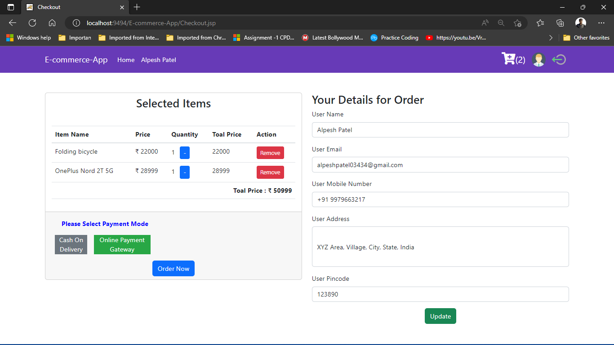

# E-commerce-web-application

There are 3 types of users in this project: User, Seller and Admin. I developed for different userType of user have different functionality to do their task. Normal user can purchase item, search item, add to cart and seller can selling items, add new categories product, change quantity of items and price and Admin can manage users and seller Accounts.

The aim of the Project creation was to practice and hand down learning to create a web application. I created a web application where users can purchase items anywhere using the Internet and sellers can sell items. Developed an E-commerce web application using html, css, javascript, bootstrap, Java, JSP, servlet, JDBC, MariaDB(SQL). 

<h5>Demo(Small) screen recorded video <a href="https://github.com/Alpeshpatel03434/E-commerce-web-application/blob/master/project-demo/part-1.mp4">Link1/Part-1</a>&nbsp;and <a href="https://github.com/Alpeshpatel03434/E-commerce-web-application/blob/master/project-demo/part-2.mp4">Link2/Part-2</a><h5>
 
 
</img>
 
</img>
 
</img>
 
</img>
 
</img>
 
</img>
 
</img>
 
</img>
 
</img>
 
</img>
 
</img>
 
</img>
 
</img>
 
</img>
 
</img>
 
</img>
 
</img>
 
</img>
 
